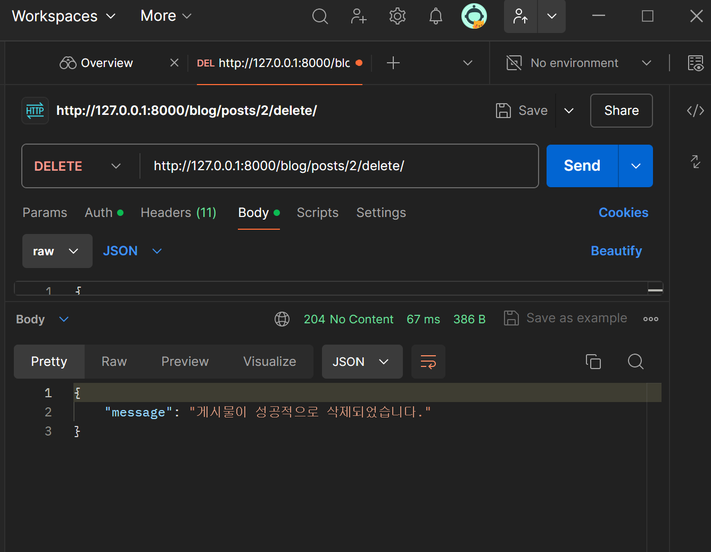

# dhs project

dhs project - 백엔드 깃헙입니다.

# USERS APP
## (api1) 회원 가입 
  

## (api2) 로그인
  

## (api3) 회원 정보 조회
  

## (api4) 회원 정보 수정
  

## (api5) 로그아웃

# BLOG APP
## (api1-1) 달성률 표시 (1) 다 지켰을때

## (api1-2) 달성률 표시 (2) 특정 항목초과

## (api2) MAIN PAGE : DATE 기준 로그인한 사용자의 모든 게시물 오름차순 정렬 출력

일부러 22일, 18일, 23일, 17일 이런식으로 순서대로 게시물 생성후, DATE 입력값 기준으로 오름차순 정렬 출력되는지 검증 완료하였습니다.

## (api3-1) 특정 게시물 조회 : 로그인한 사용자의 특정 게시물 조회 (게시물 ID 이용)
.png)

## (api3-2) 특정 게시물 조회 : 로그인한 사용자의 특정 게시물의 모든 댓글 조회

## (api4) 특정 게시물 삭제

## (api5-1) 댓글 생성

## (api5-2) 댓글 수정

## (api6) 댓글 삭제

